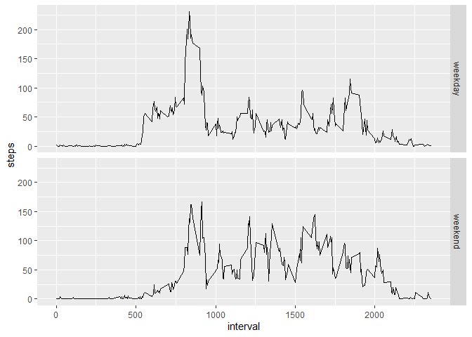

# Introduction

This assignment makes use of data from a personal activity monitoring device. This device collects data at 5 minute intervals through out the day. The data consists of two months of data from an anonymous individual collected during the months of October and November, 2012 and include the number of steps taken in 5 minute intervals each day.


## Loading and preprocessing the data

The data for this assignment can be downloaded from the course web site: 
**Dataset:** [Activity monitoring data](https://d396qusza40orc.cloudfront.net/repdata%2Fdata%2Factivity.zip) [52K]

*The dataset is stored in a comma-separated-value (CSV) file and there are a total of 17,568 observations in this dataset.*

The variables included in this dataset are:

1. Steps: Number of steps taking in a 5-minute interval (missing values are coded as NA)

2. Date: The date on which the measurement was taken in YYYY-MM-DD format

3. Interval: Identifier for the 5-minute interval in which measurement was taken


```r
library(data.table)
temp <- tempfile()
download.file("https://d396qusza40orc.cloudfront.net/repdata%2Fdata%2Factivity.zip", temp)
dt <- fread(unzip(temp, files = "activity.csv"))
rm(temp)
```

Check data to ensure loaded correctly:

```r
dim(dt)
```

```
## [1] 17568     3
```

```r
head(dt)
```

```
##    steps       date interval
## 1:    NA 2012-10-01        0
## 2:    NA 2012-10-01        5
## 3:    NA 2012-10-01       10
## 4:    NA 2012-10-01       15
## 5:    NA 2012-10-01       20
## 6:    NA 2012-10-01       25
```

## What is mean total number of steps taken per day?

**Total steps by date**

```r
totsteps <- aggregate(dt[, 1], list(dt$date), sum)
head(totsteps)
```

```
##      Group.1 steps
## 1 2012-10-01    NA
## 2 2012-10-02   126
## 3 2012-10-03 11352
## 4 2012-10-04 12116
## 5 2012-10-05 13294
## 6 2012-10-06 15420
```
**Create histogram**

```r
hist(totsteps$steps, xlab = "Daily Steps", main = "Histogram of Daily Steps")
```

<!-- -->

**Mean & Median total steps taken (ignoring NA):**

```r
mean(totsteps$steps,na.rm = TRUE)
```

```
## [1] 10766.19
```

```r
median(totsteps$steps,na.rm = TRUE)
```

```
## [1] 10765
```
## What is the average daily activity pattern?
**Average value for each 5 minute interval across all dates**

```r
avebyint <- aggregate(dt[, 1], list(dt$interval), mean, na.rm = TRUE)
head(avebyint)
```

```
##   Group.1     steps
## 1       0 1.7169811
## 2       5 0.3396226
## 3      10 0.1320755
## 4      15 0.1509434
## 5      20 0.0754717
## 6      25 2.0943396
```
**Plot the average number of steps for all 5-minute intervals**

```r
with(avebyint, plot(steps ~ Group.1, xlab = "interval"))
```

<!-- -->
**Which interval has the highest average number of steps**

```r
maxsteps <- which.max(avebyint$steps)
avebyint$Group.1[maxsteps]
```

```
## [1] 835
```


## Imputing missing values
**How many NAs are there in the dataset?**

```r
colSums(is.na(dt))
```

```
##    steps     date interval 
##     2304        0        0
```
**Create a strategy for filling in missing values**  
For this analysis we will replace each missing value with the *mean* value for that interval across all days with non-missing data during that interval

```r
dt2 <- cbind(dt,avebyint$steps)
colnames(dt2) <- c("steps","date","interval","interval_ave")
dt2$steps[is.na(dt2$steps)] <- dt2$interval_ave[is.na(dt2$steps)]
dt2$interval_ave <- NULL
```
**Using this new dataset, make a histogram and show the mean and median**

```r
totsteps2 <- aggregate(dt2[, 1], list(dt$date), sum)
hist(totsteps2$steps, xlab = "Daily Steps", main = "Histogram of Daily Steps")
```

<!-- -->

```r
mean(totsteps2$steps)
```

```
## [1] 10766.19
```

```r
median(totsteps2$steps)
```

```
## [1] 10766.19
```

*This method of imputing "added" another 8 days of data (2304 NAs / 288 intervals per day), all with the mean value of daily steps. The result is a histogram with a higher central peak. There is no change to the mean. The median shifts sligthly as the new data changes the skew.*

## Are there differences in activity patterns between weekdays and weekends?
**Using dataset with filled values, create a new factor variable with two levels -- "weekday" and "weekend"**

```r
dt2$day <- factor(as.POSIXlt(dt2$date)$wday)
#0-6 starting on Sunday (so 0 and 6 are weekend days)
levels(dt2$day) = list(weekday = c(1, 2, 3, 4, 5), weekend = c(0, 6))
```

**Next, split into two dataframes, one each for weekend and weekday and calculate the mean number of steps per interval for each**


```r
#first, split into two dataframes, one each for weekend and weekday
x <- split(dt2,dt2$day)
weekday <- x$weekday
weekend <- x$weekend

weekdayave <- aggregate(weekday[, 1], list(weekday$interval), mean)
colnames(weekdayave) <- c("interval","steps")
weekdayave$type = "weekday"
weekendave <- aggregate(weekend[, 1], list(weekend$interval), mean)
colnames(weekendave) <- c("interval","steps")
weekendave$type = "weekend"
```

**Finally, recombine into a single dataframe and create a panel plot that shows average steps by interval split out between weekend and weekday data**


```r
library(ggplot2)
dt3 <- rbind(weekdayave,weekendave)
qplot(interval, steps, data=dt3, facets=type ~.,geom='line')
```

<!-- -->
**It looks like people are more active on weekend, the data supports this**

```r
mean(weekendave$steps)
```

```
## [1] 42.3664
```

```r
mean(weekdayave$steps)
```

```
## [1] 35.61058
```
